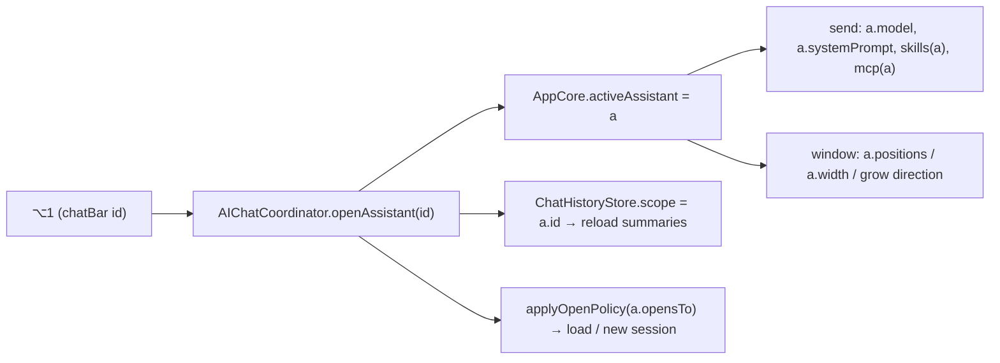

# Assistants

A design for **Assistants** — multiple, user-created, dedicated AI chat bars, each with its own
shortcut, system prompt, model, **Skills** (Claude Agent Skills) and **MCP servers**, history, and
screen placement, all remembered across sessions.

This is a fork-local feature (see [CUSTOM.md](CUSTOM.md)); it extends the AI Chat bar shipped in the
`Floating AI Chat bar` register row. It builds on and reuses the existing AI stack — one `AIChatState`,
one `ChatHistoryStore`, one `AIChatCoordinator`, the `MCPCoordinator` — rather than duplicating it.

Read [docs/features/ai.md](docs/features/ai.md) and [docs/features/mcp.md](docs/features/mcp.md) first;
this doc only covers what Assistants add on top.

## 1. What an Assistant is

Today there is one AI bar (`toggleAIBar`, ⌥Space) plus the launcher's `AI Chat` command. They share one
model, one system prompt, one MCP set and one history. An **Assistant** packages all of that per-persona:

- A **Coding** assistant — a code-review system prompt, the `filesystem` MCP server, a `pdf` skill,
  GPT‑5‑Sol — summoned on ⌥1, docked bottom-right, resuming its own transcript.
- A **Writing** assistant — a house-style prompt, no tools, Claude — on ⌥2, centred, fresh each time.

The existing default AI bar stays exactly as it is (decision 3, below); Assistants are additive, so a
regression in the new path can never touch the old one.

## 2. Terminology

| Term | Meaning |
| --- | --- |
| **Assistant** | A named, configured AI chat bar. The user-facing noun (decision 1). Model type `Assistant`. |
| **Configured assistant** | An Assistant with no code — standard chat UI, driven by its stored prompt/model/skills/MCP (§4–§13). |
| **Plugin assistant** | An Assistant a **native Swift plugin** provides — its own SwiftUI chat UI and custom behaviour, registered as a chat bar (§19). |
| **`AssistantSession`** | The host→plugin AI bridge: an observable transcript plus `send`/`stop`/`newChat`, handed to a plugin assistant's surface so it talks to the model without touching host internals (§19). |
| **Skill** | A **Claude Agent Skill** — a `SKILL.md` file (+ optional bundled resources) with a name, a description, and instruction text. A *library* of skills exists; each assistant enables a subset. Distinct from MCP (decision 2). |
| **MCP server** | An existing `MCPServer` (tool provider). Each assistant enables a subset. |
| **Default bar** | Today's `toggleAIBar` + `AI Chat` command. Unchanged, global settings, unscoped history. Not an Assistant. |
| **Active assistant** | The one currently shown in the palette's `.ai` screen. `AppCore.activeAssistant: Assistant?` — `nil` means the default bar. |

## 3. Decisions (locked)

1. **Name:** *Assistant*.
2. **Skills:** Claude Agent Skills (`SKILL.md`), a **separate** subsystem from MCP. **Both** are supported
   per assistant.
3. **Default bar kept separate** — it is the "default" and stays unchanged, minimising regression surface.
4. **History:** one shared `ai-chats.sqlite3`, rows **scoped by assistant id** (a new `assistant_id`
   column). Not separate DB files.
5. **All extras** from the proposal are in scope: per-assistant icon/colour, ephemeral mode, per-assistant
   `opens to`, a launcher command per assistant, per-assistant width/size, and a seed/example prompt.

## 4. Data models (pure — `Features/AI/Model/`)

### `Assistant`

```swift
struct Assistant: Identifiable, Codable, Sendable, Equatable {
    let id: UUID
    /// Configured (standard chat UI) or provided by a Swift plugin (custom UI + behaviour) — §19.
    /// A plugin assistant ignores the prompt/skill/MCP fields the plugin owns; it keeps the rest
    /// (shortcut, placement, width, history scope, retention, ephemeral).
    var provider: AssistantProvider     // .configured | .plugin(pluginID:, descriptorID:)
    var name: String                    // "Coding"
    var symbol: String                  // SF Symbol name or emoji — the leading glyph & launcher icon
    var tint: AssistantTint             // an accent for the glyph (a small named palette)
    var systemPrompt: String            // dedicated prompt (appended to the preamble)
    var systemPromptEnabled: Bool
    var model: AIModelSelection?        // nil ⇒ fall back to the global default model
    var webSearch: Bool
    var skillIDs: Set<UUID>             // enabled Skills (a subset of the library)
    var mcpServerIDs: Set<UUID>         // enabled MCP servers (a subset of the library)
    var opensTo: AIOpensTo              // resume vs fresh, per assistant
    var newChatAfter: AINewChatAfter
    var retention: AIRetention
    var ephemeral: Bool                 // true ⇒ never persist this assistant's chats
    var seedPrompt: String              // optional empty-state hint / example
    var positions: [String: [Double]]   // per-display placement offset (like aiBarPosition)
    var width: CGFloat?                 // optional per-assistant panel width (nil ⇒ default panelWidth)
    var order: Int                      // list ordering
}
```

### `Skill`

Parsed from a Claude Agent Skill. A skill's **body** is instruction text; a skill *folder* may bundle
resources, but Tinycast's routes cannot execute bundled scripts (see §6.3), so v1 uses the instruction
text only.

```swift
struct Skill: Identifiable, Codable, Sendable, Equatable {
    let id: UUID
    var name: String            // from SKILL.md frontmatter `name`
    var summary: String         // from frontmatter `description` — "when to use this"
    var instructions: String    // the SKILL.md body (markdown, minus frontmatter)
    var slug: String            // derived from name, uniqued (like MCPSlug)
    var sourcePath: String      // the imported folder under application-support/skills/<slug>/
    var enabledInLibrary: Bool  // a global off switch, like an MCP server's
}
```

### Stores (`Service/`, `@MainActor @Observable`)

- **`AssistantStore`** — `private(set) var assistants: [Assistant]`, persisted as JSON in `UserDefaults`
  under a new `aiAssistants` key. CRUD + reordering; each mutation persists. Backup-excluded.
- **`SkillStore`** — `private(set) var skills: [Skill]`, a library scanned from and imported into
  `application-support/skills/`. Import copies a `SKILL.md` (or a folder containing one), parses the
  frontmatter and body, uniques the slug. Metadata cached in `UserDefaults` (`aiSkills`); the bodies live
  on disk and load lazily. Backup-excluded (a skill is instruction content the model is billed for, and a
  destination for chat context).

## 5. `SKILL.md` — the Claude Agent Skill format

A skill is a folder whose entry point is `SKILL.md`:

```
skill-name/
  SKILL.md          ← required: YAML frontmatter + markdown body
  reference.md      ← optional bundled resources (not executed; may be inlined if referenced)
  scripts/…         ← optional; NOT run by Tinycast (sandbox), see §6.3
```

`SKILL.md`:

```markdown
---
name: pdf-forms
description: Fill, read and flatten PDF forms. Use when the user works with PDF documents.
---

# PDF forms

Step-by-step instructions the model should follow when this skill is active…
```

- **Required frontmatter:** `name`, `description`. Parsed by a small `SkillFrontmatter` reader (the
  frontmatter is simple `key: value`; no full YAML needed). `Model/` stays Foundation-only.
- The **body** (everything after the closing `---`) is the instruction text injected into the request.
- **Progressive disclosure** (Anthropic's model — inject only name+description, let the model pull the
  body on demand) is a **future enhancement**; v1 injects curated bodies in full, bounded (see §6.2),
  because an assistant's skills are hand-picked and few.

## 6. How Skills and MCP reach the model

### 6.1 MCP (unchanged mechanism, newly scoped)

`AIChatCoordinator.send` already scopes tools via `MCPCoordinator.tools(scopedTo: slug)`. Add an
`allowed: Set<UUID>?` parameter so a turn offers only the **active assistant's** MCP servers
(`allowed = activeAssistant?.mcpServerIDs`; `nil` = the default bar = all enabled servers). `@slug`
addressing still narrows within that set. MCP tools remain **API-routes-only** per the existing invariant.

### 6.2 Skills (new — instruction injection)

Skills are text, so they work on **every** route (Apple Intelligence included). At send time,
`AIInstructions.compose` gains a `skills:` argument:

```
preamble
+ assistant.systemPrompt            (if enabled)
+ "# Skills\n" + for each enabled skill: "## <name>\n<instructions>"   (bounded)
```

- One **skills budget** (`AISkillBudget`, e.g. ~16 KB) caps the injected total; skills are added
  newest/most-relevant first until it fills, then a line notes the rest were omitted. On Apple
  Intelligence the budget is far smaller (its context holds a prompt + reply together).
- Injected every turn ⇒ **billed every turn**, exactly like the system prompt. The editor states this.

### 6.3 What skills can't do (v1)

Bundled **scripts are not executed** — the API/Apple-Intelligence routes have no execution surface, and
the Claude/OpenCode/Codex CLI routes run sandboxed with tools disabled per the AI invariants. So a skill
contributes its **instructions** only. Documented as a known limitation; native skill execution on the
CLI routes is a possible later phase.

## 7. Runtime routing — one active assistant re-points the existing stack

No second `AIChatState`. `AppCore.activeAssistant: Assistant?` re-points the single stack; `nil` = default
bar (today's behaviour, byte-for-byte). `AIChatCoordinator` reads the active assistant in the four places
it already owns:



Concretely:

| Send-path input | Default (`activeAssistant == nil`) | Assistant `a` |
| --- | --- | --- |
| model | `aiSettings.defaultModel` | `a.model ?? aiSettings.defaultModel` |
| instructions | `compose(aiSettings.systemPrompt)` | `compose(a.systemPrompt, skills: enabled(a))` |
| tools | `mcp.tools(scopedTo:)` | `mcp.tools(scopedTo:, allowed: a.mcpServerIDs)` |
| web search | `aiSettings.webSearchEnabled` | `a.webSearch` |
| open policy | `aiSettings.opensTo/newChatAfter` | `a.opensTo/newChatAfter` |
| retention | `aiSettings.retention` | `a.retention` |
| placement | `aiBarPosition` | `a.positions` + `a.width` |

The header model/reasoning menus write to **`a.model`** when an assistant is active (persisted on the
assistant), and to the global default otherwise. `PaletteWindowController.storedPosition/setStoredPosition`
gain an assistant branch (they already branch aiBar vs launcher). Switching assistants saves the current
session, re-scopes history, and applies the new one's open policy — the same beats `toggleBar` already runs.

## 8. Hotkeys — per-assistant, UUID-keyed

Mirror the existing per-item pattern (`customCommand`, `quicklink`, `windowLayout`):

- `HotKeyAction.assistant(id: UUID)`; `defaultsKey = "hotkey.assistant.<uuid>"`.
- `HotKeyManager.boundAssistantIDs` index + `start()` re-registration + prune of bindings whose assistant
  was deleted (identical to `boundCustomCommandIDs`); added to the `setBinding` index switch,
  `builtInActions` stays as-is (these are per-item, not fixed).
- `AppCore` wires `onOpenAssistant = { id in aiChatCoordinator.openAssistant(id:) }`; add `.assistant` to
  the exhaustive `HotKeyAction` switches (`defaultsKey`, `HotKeyManager.perform`/`displayName`/index,
  `VisibilityStore.allowsHotKey`, `AppCore.hotKeyDisplayName`).

## 9. Launcher command per assistant

Each assistant also appears in the launcher as **`Ask <Name>`** (its icon = `a.symbol`/`a.tint`), so it is
searchable and runnable without a chord. This reuses the dynamic per-item command surface (the same shape
quicklinks/custom-commands use to appear as launcher rows and to be bindable). Running the row calls
`openAssistant(id:)`.

## 10. History scoping

Additive migration on `ChatHistoryStore`:

- `ALTER TABLE conversations ADD COLUMN assistant_id TEXT;` — existing rows get `NULL` = the default bar,
  so nothing is lost or reattributed. Guarded so it runs once (check `PRAGMA table_info`).
- `ChatHistoryStore` gains `var scope: UUID?`. `load()`, `search()` and the resident `conversations` list
  filter `WHERE assistant_id IS ?` (or `IS NULL` for the default). `save()` stamps the current scope.
  `prune(before:)` prunes within scope. `conversations_by_recency` index extended to `(assistant_id,
  updated_at DESC)`.
- **Ephemeral assistants** skip `save` entirely — the transcript lives only in memory and is dropped on
  New Chat / close.
- Switching the active assistant sets `scope` and reloads summaries; the ⌘K Chat History screen then lists
  only that assistant's chats.

## 11. Persistence across sessions

| Property | Store | Backup |
| --- | --- | --- |
| name, icon, tint, prompt, skill/MCP subsets, opens-to, retention, ephemeral, seed | `Assistant` JSON — `UserDefaults` key `aiAssistants` | excluded |
| chosen model + reasoning effort | `Assistant.model` | excluded |
| screen position (per display) + width | `Assistant.positions` / `Assistant.width` | excluded |
| hotkey | `hotkey.assistant.<uuid>` | excluded |
| launcher-command hotkey/alias | existing per-item indices | excluded |
| skill library (metadata) | `UserDefaults` `aiSkills` + files under `application-support/skills/` | excluded |
| transcripts | `ai-chats.sqlite3`, scoped by `assistant_id` | excluded (as today) |

All of AI stays out of settings backups per the existing "no AI setting travels" invariant; every new key
is added to `SettingsBackupCoverage.deliberatelyExcluded` with a reason (the `settings-backup-test`
enforces this).

## 12. Settings UI (Settings → AI)

Two new sections plus one editor sheet:

- **Assistants** — a reorderable list: icon + name + shortcut recorder + live status (model, #skills,
  #MCP). Add / Duplicate / Remove. "Add" seeds a blank assistant; "Duplicate" clones one.
- **Skills** — a library list like MCP's: name + summary + enabled toggle; **Import Skill…** (folder or
  `SKILL.md`) and Remove. Parses and shows frontmatter errors inline.
- **`AssistantEditorSheet`** (modeled on `MCPServerEditor` / `AIConnectionEditorSheet`): name, icon +
  tint picker, `ShortcutRecorder(action: .assistant(id:))`, `SystemPromptEditor`, model picker,
  web-search toggle, **Skills** checkboxes, **MCP servers** checkboxes, `opens to` / `new chat after`,
  retention, ephemeral toggle, seed prompt. A footer notes prompt+skills are billed every turn.

## 13. Extras (all in v1)

- **Icon + tint** per assistant — in the bar's leading glyph and the launcher row.
- **Ephemeral mode** — no saved history (scratch / sensitive work).
- **Per-assistant `opens to` / `new chat after`** — fresh vs resume, per persona.
- **Launcher command** `Ask <Name>` (§9).
- **Per-assistant width/size** — the panel may open at `a.width`; `PaletteWindowController` reads it
  instead of the fixed `panelWidth` when an assistant is active. Position + width = "size remembered".
- **Seed/example prompt** — shown in the empty-state under "Ask anything…".

## 14. Invariants (new)

- **The default bar is untouched.** With `activeAssistant == nil`, every send-path input, placement key
  and history query is byte-for-byte today's behaviour. This is the regression firewall.
- **Assistants, Skills and every new key are backup-excluded**, like all AI state — an import can never
  arm an assistant, a skill (instruction content) or a tool set it cannot configure.
- **Skills contribute instructions, never execution.** No bundled script runs; the routes have no
  execution surface. MCP tools remain API-routes-only.
- **`assistant_id` is additive and NULL-preserving.** The migration never rewrites an existing chat's
  attribution; NULL is the default bar forever.
- **One `AIChatState`, re-pointed.** Only one assistant is live at a time; switching saves then re-scopes.
  No second actor, no second chat state.
- **`Model/` stays Foundation-only** — `Assistant`, `Skill`, `SkillFrontmatter`, `AssistantOpenPolicy`
  and the skills budget are pure and harness-pinned (`assistant-test`, extending `ai-chat-test`).

## 15. Phasing (build + test each before the next)

1. **Models + stores** — `Assistant`, `AssistantStore`, `Skill`, `SkillStore`, `SkillFrontmatter`, backup
   exclusions, `assistant-test`. No behaviour change yet. *Low risk.*
2. **Skills parsing + injection** — `SkillFrontmatter` parse, `AIInstructions.compose(skills:)`, budget.
   *Low–medium.*
3. **Hotkeys** — `.assistant(id:)`, bound index, wiring, exhaustive-switch updates. *Low (mirrors pattern).*
4. **Active-assistant routing** — `AppCore.activeAssistant`, `openAssistant`, `AIChatCoordinator` model/
   prompt/tools/webSearch/open-policy branches, header menus write to the assistant, placement/width.
   **Highest risk** — the send path; the `activeAssistant == nil` firewall + `ai-chat-test` guard it.
5. **History scoping** — `assistant_id` migration + `scope`, ephemeral skip. *Medium (SQLite).* 
6. **Settings UI** — Assistants list, Skills library, `AssistantEditorSheet`.
7. **Launcher command + icon/tint + width/size + seed prompt** — the remaining extras.
8–9. **Plugin assistants** (custom SwiftUI UI + behaviour) — a later track that builds on 1–7 and the
   native plugin system; contract, bridge and host integration. See **§19.7**.

## 16. Testing plan

- **Harness:** `assistant-test` (pure) pins `Assistant`/`Skill` codec, `SkillFrontmatter` parsing (valid,
  missing keys, no frontmatter), the skills budget trim, and `AssistantOpenPolicy`. Extend `ai-chat-test`
  for the scoped send composition and `settings-backup-test` for the new excluded keys. Extend
  `hotkey-test` for `.assistant` defaults-key uniqueness.
- **Driven UI** ([UI_TESTS.md](UI_TESTS.md)): create two assistants with distinct shortcuts, prompts,
  skills and MCP sets; verify each summons to its own placement/width, resumes its own history, applies
  its own model/prompt/skills, and that the default bar is unchanged. Capture a panel per state.
- **Manual sweep:** ephemeral leaves no row; import a `SKILL.md`, enable it on one assistant, confirm its
  instructions steer that assistant and not another; delete an assistant and confirm its hotkey, launcher
  row and (non-ephemeral) history handling are pruned/retained as specified.

## 17. File inventory

**New**
```
Assistant_Architecture.md
Tinycast/Features/AI/Model/{Assistant,Skill,SkillFrontmatter,AssistantOpenPolicy}.swift
Tinycast/Features/AI/Service/{AssistantStore,SkillStore}.swift
Tinycast/Features/AI/Settings/{AssistantsSettingsSection,AssistantEditorSheet,SkillsSettingsSection}.swift
Tests/assistant-test.swift
Tinycast_addons: a sample AssistantPlugin (lives outside this repo, see CUSTOM.md)
```

**Changed**
```
App/AppCore.swift                         activeAssistant, stores, openAssistant wiring, hotkey callback
Features/AI/UI/AIChatCoordinator.swift    openAssistant + bar-aware send / open policy / model selection
Features/AI/UI/AIChatState.swift          (unchanged if re-pointed; else scope hooks)
Features/AI/Model/AIInstructions.swift    compose(skills:)
Features/AI/Service/ChatHistoryStore.swift assistant_id migration + scope
Features/MCP/UI/MCPCoordinator.swift      tools(scopedTo:, allowed:)
Features/HotKeys/Model/HotKeyAction.swift .assistant(id:)
Features/HotKeys/Service/HotKeyManager.swift boundAssistantIDs + perform/displayName/index
Features/Launcher/Service/VisibilityStore.swift .assistant in allowsHotKey
Features/Settings/{AppSettingsKey,SettingsSearchCatalog}.swift new keys / search rows
Features/Backup/Model/SettingsBackupCoverage.swift exclusions
Palette/PaletteWindowController.swift     per-assistant position + width
Palette/RootPaletteView.swift             per-assistant icon/tint, seed prompt in empty state
Features/AI/Settings/AISettingsView.swift host the two new sections
docs/features/ai.md                       document Assistants; CUSTOM.md register row
TinycastPluginKit/TinycastPluginKit.swift  AssistantPlugin, AssistantDescriptor, AssistantSession, …
Features/Plugins/Service/PluginManager.swift  discover AssistantPlugin, read descriptors
Features/Plugins/UI/PluginCoordinator.swift   host AssistantSessionBridge + render assistant surface
```

## 18. Open items / future

- **Progressive disclosure** for skills (inject name+description; model pulls the body via a tool) — more
  faithful to Anthropic's model, needs tool support, API-routes-only.
- **Native skill execution** on the Claude/OpenCode CLIs (if a sandbox-safe path exists).
- **Sharing/exporting** an assistant (its config minus credentials) — deliberately not a backup, so a
  separate explicit export.

## 19. Pluggable Assistants (Swift plugins)

An Assistant can be **provided by a native Swift plugin** instead of configured: the plugin renders its
own SwiftUI chat UI and adds custom behaviour, and the host registers it as a chat bar with a shortcut,
placement, history slot and everything a configured assistant has. This reuses the existing native plugin
system ([plugins.md](docs/features/plugins.md), a fork feature) — a prebuilt, trusted, in-process `.dylib`
that links `TinycastPluginKit.framework`.

### 19.1 The contract (additions to `TinycastPluginKit`)

A plugin opts in by also conforming to `AssistantPlugin`, which extends the existing `TinycastPlugin`:

```swift
@MainActor
public protocol AssistantPlugin: TinycastPlugin {
    /// The assistants this plugin contributes; each becomes a registerable chat bar.
    static var assistants: [AssistantDescriptor] { get }
    /// The custom SwiftUI chat surface for one assistant. The host hands it a live session
    /// (send / stream / history) and the presentation context; the plugin renders whatever it wants.
    func assistantSurface(id: String, session: any AssistantSession, context: PluginContext) -> AnyView
}

public struct AssistantDescriptor: Sendable, Equatable {
    public var id: String                     // stable within the plugin
    public var name: String
    public var icon: PluginIcon
    public var defaultSystemPrompt: String?   // seeds the host-side Assistant config
    public var suggestedModel: String?        // a hint the editor offers
}
```

`AssistantDescriptor`s are read the moment the dylib loads (like `PluginMetadata`), so the host lists the
assistant before paying for the code behind it.

### 19.2 The AI bridge — `AssistantSession`

A plugin never reaches into `AIChatState` or the provider layer. The host implements `AssistantSession`
and passes a live one into the surface; the plugin drives the model through it and observes the transcript:

```swift
@MainActor @Observable
public protocol AssistantSession: AnyObject {
    var messages: [AssistantMessage] { get }   // the live transcript
    var isStreaming: Bool { get }
    var model: AssistantModel { get }          // the resolved route + its capabilities

    func send(_ text: String)
    /// Custom behaviour: a per-turn prompt override and plugin-provided tools the model may call.
    func send(_ text: String, instructions: String?, tools: [AssistantTool])
    func stop()
    func newChat()
    func openChat(id: UUID)                     // if the plugin renders its own history list
}

public struct AssistantMessage: Sendable, Identifiable, Equatable { /* role, text, state, id */ }
public struct AssistantModel: Sendable, Equatable { /* id, name, supportsTools, supportsImages */ }
/// A function the plugin implements and the model may call — the plugin's own custom functionality.
public struct AssistantTool: Sendable {
    public var name: String
    public var description: String
    public var jsonSchema: String
    public var invoke: @Sendable (_ arguments: String) async -> String
}
```

- The host backs the session with the same `AIChatState` + `AIChatCoordinator`, scoped to this assistant
  (its model, history, retention). `send(_:instructions:tools:)` layers the plugin's tools onto the
  existing `AIToolLoopProvider` and overrides the composed instructions for that turn.
- A plugin wanting a fully bespoke experience can ignore `send` and render anything — being an assistant
  just grants a chat-bar summon (shortcut, placement, history slot). It is trusted native code, so it may
  also call APIs, show widgets and keep its own state.
- The contract is the **framework, one copy**, exactly like `TinycastPlugin`: `AssistantSession` and its
  value types are the same types across the `dlopen` boundary, so the bridge never mismatches.

### 19.3 Discovery, registration, rendering

- `PluginManager` already loads dylibs; on load it also checks `plugin as? AssistantPlugin` and reads its
  `assistants`. For each descriptor the host **materialises an `Assistant`** with
  `provider = .plugin(pluginID:, descriptorID:)`, seeded from the descriptor — a first-class, persisted
  Assistant with its own shortcut, placement, width, history scope and retention. Removing the plugin
  greys its assistants (kept, restorable) rather than dropping their config.
- Summoning a plugin assistant enters the assistant palette mode, but the body renders the plugin's
  `assistantSurface(id:session:context:)` — hosted like the existing `.surface` path (the plugin owns the
  panel; it may wrap in `PluginScaffold` or draw bare). The host builds the `AssistantSession` from the
  scoped `AIChatState`/coordinator and injects it. Placement, growth direction and width come from the
  `Assistant` config exactly as for a configured one.
- The **Assistants settings list** shows both kinds; a plugin assistant is badged "provided by <plugin>",
  its plugin-owned fields read-only, its host fields (shortcut, placement, model where allowed, retention,
  ephemeral) editable.

### 19.4 Model & routing

- `Assistant.provider: AssistantProvider = .configured | .plugin(pluginID: String, descriptorID: String)`.
- The palette body chooses the surface: `.plugin` → the plugin surface, `.configured` → the standard
  `AIScreen`. Everything else (hotkey, history scope, placement/width, retention, ephemeral) is identical,
  so a plugin assistant reuses the whole assistant machinery.

### 19.5 Security & consent

A plugin assistant is native code in Tinycast's process — unsandboxed, full privileges, the existing
plugin trust model. It needs **both** `aiEnabled` and `pluginsEnabled` (which already confirms before
turning on, carries the library-validation entitlement, and is backup-excluded). No plugin, assistant or
otherwise, is ever armed by importing a backup.

### 19.6 Invariants (plugin assistants)

- **The bridge is the framework.** A plugin talks to the AI only through `AssistantSession`; it never
  imports or links the host's AI types. One copy of the contract, like `TinycastPlugin`.
- **A plugin assistant is a normal `Assistant` from the host's side** — persisted shortcut, placement,
  width, scoped history, retention — so `provider == .configured` and `activeAssistant == nil` stay
  untouched by anything a plugin does. Same regression firewall.
- **Native-code consent still gates it:** `pluginsEnabled` in addition to `aiEnabled`.
- **Removing a plugin never drops its assistants' config** — kept, greyed, restorable.

### 19.7 Phasing

Plugin assistants land **after** configured assistants (phases 1–7), because they build on the assistant
machinery and the plugin system:

- **Phase 8 — contract:** `AssistantPlugin`, `AssistantDescriptor`, `AssistantSession`, `AssistantMessage`,
  `AssistantModel`, `AssistantTool` in `TinycastPluginKit`; a host `AssistantSessionBridge` implementing
  the protocol over `AIChatState`/`AIChatCoordinator`; a sample assistant plugin in `tinycast_addons`.
- **Phase 9 — host integration:** `PluginManager` discovery, `AssistantStore` materialising plugin-backed
  `Assistant`s, the palette rendering the plugin surface, and the settings "provided by <plugin>" badge and
  read-only handling.
